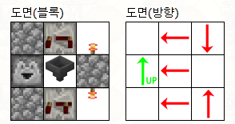
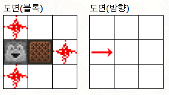
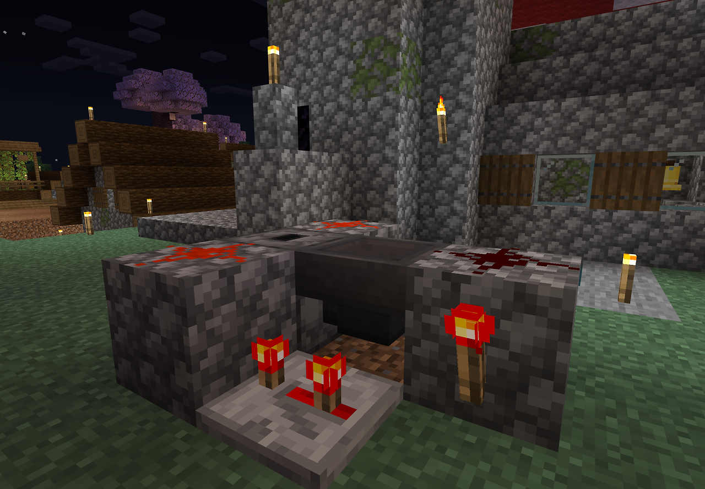
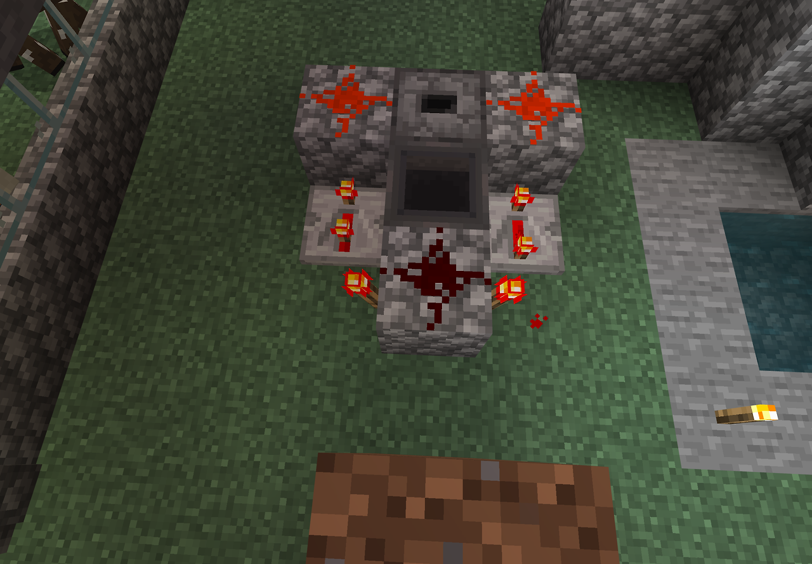
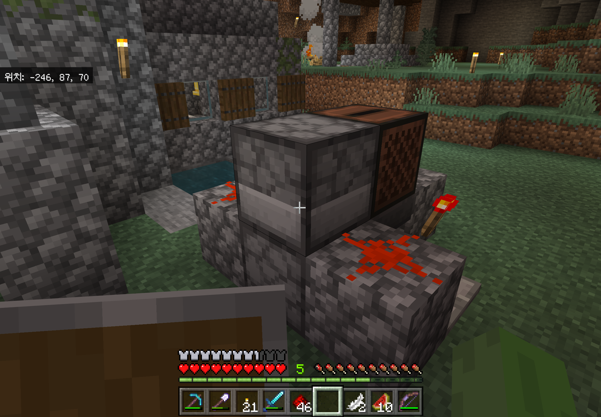

<iframe src="https://www.youtube.com/embed/hbz4j6qCnSE" width="405" height="720" frameborder="0" allowfullscreen="true"></iframe>

쥬크박스 무한재생 회로를 만들어 보았다

아래는 도면이고 스크린샷도 같이 참고하자

준비물 : 주크박스, 호퍼(깔때기), 드로퍼 2개, 리피터 (레드스톤 탐지기 ) 2개, 레드스톤 토치 2개, 레드스톤 3개, 아무블럭 3개

1층

2층

설치 잘 안될땐 앉기후 설치

1층

왼쪽 리피터는 2번터치

오른쪽 리피터는  3번터치

드로워는 위를 보도록 깔아준다

호퍼는 드로워를 보도록 설치한다

2층

드로워가 주크박스를 향하게 설치하고 디스크를 넣어준다

여러곡 번갈아가면서 재생하고 싶으면 추가곡들을 드로퍼 안에 넣어준다

끝

근데 저 3x3x2회로 만들고 보니까 2x3x3이 필요하더라..

그래서 하나 더 만들었다

[2x3x3](../2x3x3/ko.md)
